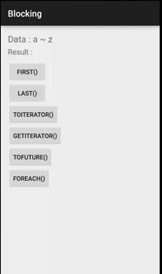

BlockingObservable

주입된 데이터를 블럭단위로 보고 이를 처리하기 위한 로직입니다.

생성 방법

```
BlockingObservable.from(Observable);

Observable.toBlocking();
```



* forEach
 - 주입된 데이터를 1개씩 처리하는 함수

* first
 - 주입된 데이터 중 제일 처음 주입된 데이터를 처리하는 함수 

* last
 - 마지막으로 주입된 데이터를 처리하는 함수

* toIterable
 - 주입된 데이터를 Iterable 로 변환하는 함수

* getIterator
 - 주입된 데이터를 Iterator 로 변환하는 함수

* toFuture
 - 주입된 데이터 1개를 Future 형 변수로 변환하는 함수
 - 주의사항 : 1개의 데이터만 주입해야 함.