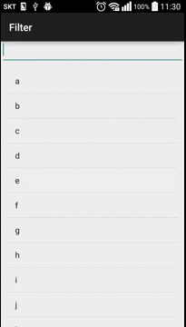

Filter
 - 특정 Observer 로 들어오는 객체를 선별적으로 처리할 수 있도록 전처리를 도와주는 기능

본 예제는 2중 필터로 구현되어 있습니다.



```java

final String[] filters = new String[s.length()];
for (int idx = 0; idx < s.length(); idx++) {
    filters[idx] = s.subSequence(idx, idx + 1).toString();
}

Observable
    .from(alphabets)
    // 알파벳 문자열로 필터 요청
    .filter(new Func1<String, Boolean>() {
        @Override
        public Boolean call(final String alphabet) {

			// 필터를 1문자씩 나눠 필터링
            return Observable.from(filters)
                    .filter(new Func1<String, Boolean>() {
                        @Override
                        public Boolean call(String filter) {
                            return alphabet.contains(filter);
                        }
                    })
                    .map(new Func1<String, Boolean>() {
                        @Override
                        public Boolean call(String s) {
                            return true;
                        }
                    }).toBlocking()
                    .firstOrDefault(false);
        }
    })
    .subscribe(new Action1<String>() {
        @Override
        public void call(String s) {
            adapter.add(s);
        }
    });
```