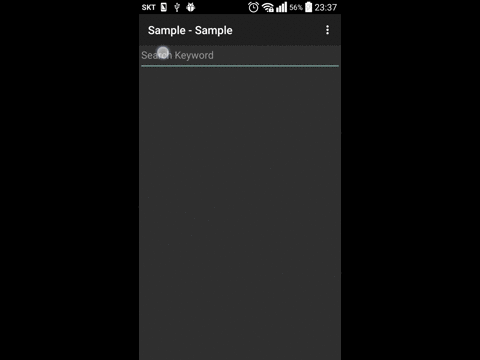
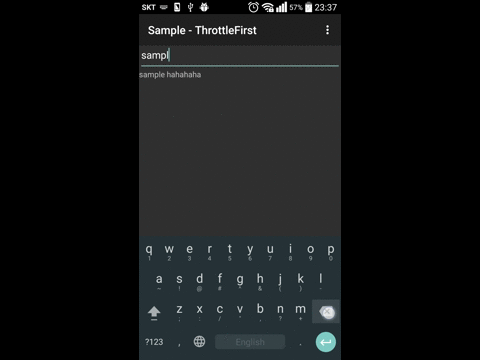
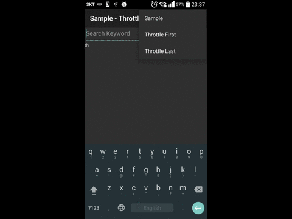

RxJava - Samples

1. Sample
2. ThrottleFirst
3. ThrottleLast

* Sample
 - 특정 구간동안 주입된 데이터 중 마지막 데이터를 받아서 처리하는 것

 

* Throttle Fist
 - 최초 입력으로 부터 특정 구간 동안 입력된 데이터 중 최초의 데이터를 받아서 처리하는 것

* Throttle Last
 - 최초 입력으로 부터 특정 구간 동안 입력된 데이터 중 마지막 데이터를 받아서 처리 하는것

Samples 와 ThrottleLast 는 비슷한 동작처럼 보여지나
실제로는 Samples 는 특정 간격으로 계속적으로 데이터를 처리하며 
ThrottleLast 는 입력 후 특정 간격 동안의 마지막 데이터로 처리하는 것이 특징이다

출처 : [reactive.io 의 Sample](http://reactivex.io/documentation/operators/sample.html)
